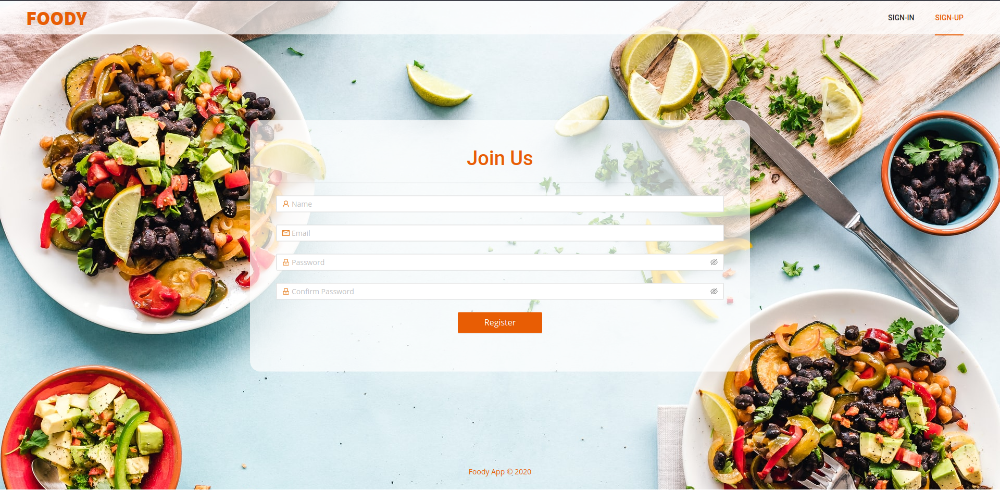

# foody-recipe-app-fe



[](https://github.com/RichardLitt/standard-readme)
[](https://app.netlify.com/sites/foody-recipe-app/deploys)


A simple food recipe listing directory. The food you love.

## Table of Contents

- [foody-recipe-app-fe](#foody-recipe-app-fe)
  - [Table of Contents](#table-of-contents)
  - [Background](#background)
  - [Install](#install)
  - [Usage](#usage)
    - [`yarn start`](#yarn-start)
    - [`yarn test`](#yarn-test)
    - [`yarn build`](#yarn-build)
  - [API](#api)
  - [Maintainers](#maintainers)
  - [Contributing](#contributing)
  - [License](#license)

## Background

## Install

In the project directory, run:

```
yarn install
```

## Usage

In the project directory, you can run:

### `yarn start`

Runs the app in the development mode.<br />
Open [http://localhost:3000](http://localhost:3000) to view it in the browser.

The page will reload if you make edits.<br />
You will also see any lint errors in the console.

### `yarn test`

Launches the test runner in the interactive watch mode.<br />
See the section about [running tests](https://facebook.github.io/create-react-app/docs/running-tests) for more information.

### `yarn build`

Builds the app for production to the `build` folder.<br />
It correctly bundles React in production mode and optimizes the build for the best performance.

The build is minified and the filenames include the hashes.<br />
Your app is ready to be deployed!

See the section about [deployment](https://facebook.github.io/create-react-app/docs/deployment) for more information.

## API

Check [foody-recipe-app-api](https://github.com/dipto0321/foody-recipe-app-api) to learn more about the API

## Maintainers

[@dipto0321](https://github.com/dipto0321)

## Contributing

See [the contributing file](contributing.md)!

PRs accepted.

## License

MIT © 2020 Dipto Karmakar
